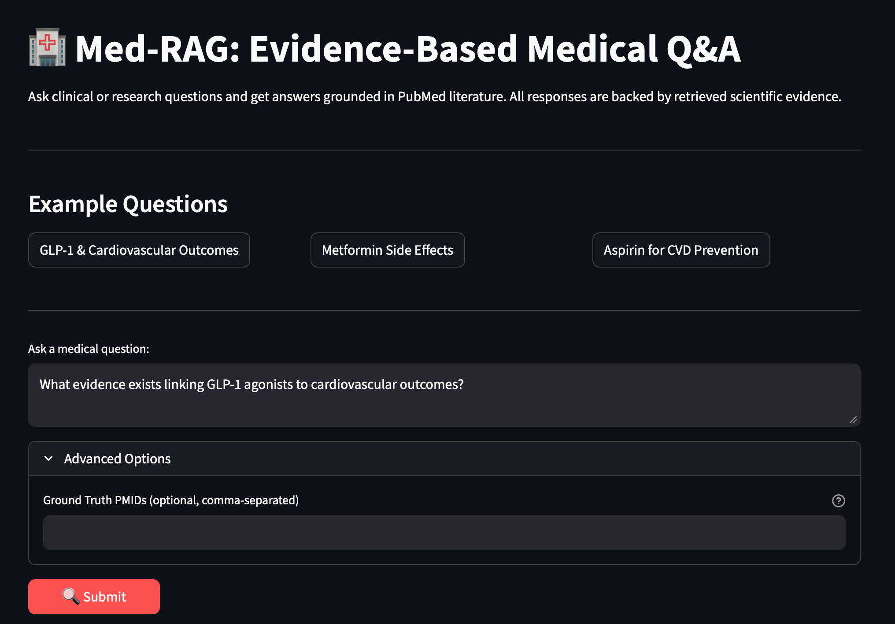

# Med-RAG: A Retrieval-Augmented System for Evidence-Based Medical Q&A
**Documentation for this project created by Claude Sonnet 4.5**




## Overview
Med-RAG is a lightweight, fully explainable Retrieval-Augmented Generation (RAG) system that answers clinical and research questions grounded in PubMed abstracts.

**The system:**
- Retrieves biomedical literature from PubMed via Entrez API
- Uses domain-specific embeddings (PubMedBERT)
- Performs vector similarity search via FAISS
- Constrains LLM responses to retrieved evidence
- Minimizes hallucination risk through grounded generation

---

## Motivation

Large language models hallucinate when operating without grounded knowledge. In medicine, this is unacceptable.

This project demonstrates how retrieval-based grounding improves factual reliability and transparency in clinical question answering.

---

## Architecture

1. **PubMed Ingestion**: Fetch abstracts via NCBI Entrez API
2. **Chunking**: Split abstracts into semantically coherent segments
3. **Embedding**: Encode chunks using PubMedBERT (biomedical domain model)
4. **Indexing**: Store embeddings in FAISS for fast similarity search
5. **Retrieval**: Find top-k most relevant chunks for user query
6. **Generation**: LLM synthesizes answer constrained to retrieved evidence
7. **Evaluation**: Assess retrieval recall and faithfulness

---

## Setup

### 1. Environment Setup

```bash
# Create virtual environment with pyenv
pyenv virtualenv 3.13.12 med-rag
pyenv local med-rag

# Or use standard venv
python -m venv .venv
source .venv/bin/activate  # On Windows: .venv\Scripts\activate

# Install dependencies
pip install -r requirements.txt
```

### 2. Configuration

Copy `.env.example` to `.env` and fill in required values:

```bash
cp .env.example .env
```

**Required environment variables:**

```bash
# OpenRouter LLM Configuration
OPENROUTER_API_KEY=your_api_key_here
OPENROUTER_MODEL=meta-llama/llama-3.3-70b-instruct:free
OPENROUTER_BASE_URL=https://openrouter.ai/api/v1

# PubMed/Entrez Configuration
ENTREZ_EMAIL=your.email@example.com
ENTREZ_API_KEY=your_ncbi_api_key  # Optional but recommended

# Optional: Default PubMed query for index building
PUBMED_DEFAULT_QUERY=GLP-1 cardiovascular outcomes
```

**Get API Keys:**
- OpenRouter: https://openrouter.ai/
- NCBI API Key: https://ncbiinsights.ncbi.nlm.nih.gov/2017/11/02/new-api-keys-for-the-e-utilities/

---

## Usage

### Quick Start (Recommended)

Start both the API and Streamlit UI with one command:

```bash
# Start both FastAPI backend and Streamlit frontend
./scripts/start_dev.sh
```

This will start:
- **FastAPI backend** at http://localhost:8000
- **Streamlit UI** at http://localhost:8501

Press `Ctrl+C` to stop both services.

### Manual Start

#### Option 1: Streamlit UI (User-Friendly)

```bash
# Start the FastAPI backend (in one terminal)
uvicorn src.api:app --reload

# Start the Streamlit frontend (in another terminal)
streamlit run src/app.py
```

Then open http://localhost:8501 in your browser to use the interactive UI.

#### Option 2: API Only (For Programmatic Access)

```bash
# Start the FastAPI server
uvicorn src.api:app --reload

# Server will be available at http://localhost:8000
# API docs at http://localhost:8000/docs
```

### Testing the API

```bash
# Run test script
python scripts/test_api.py
```

### Example API Request

```bash
curl -X POST "http://localhost:8000/query" \
  -H "Content-Type: application/json" \
  -d '{
    "question": "What evidence exists linking GLP-1 agonists to cardiovascular outcomes?"
  }'
```

**Response:**
```json
{
  "answer": {
    "question": "What evidence exists linking GLP-1 agonists to cardiovascular outcomes?",
    "answer_summary": "Multiple clinical trials demonstrate...",
    "evidence": [
      {
        "pmid": "12345678",
        "excerpt": "GLP-1 agonists reduced cardiovascular events by..."
      }
    ],
    "confidence": 0.85
  },
  "metrics": {
    "retrieval_recall": 0.8,
    "faithful": true
  }
}
```

### API Endpoints

- `GET /health` - Health check and index status
- `POST /query` - Submit medical question for RAG-based answer

---

## Project Structure

```
med-rag/
├── src/
│   ├── api.py              # FastAPI application with lifespan management
│   ├── app_state.py        # Application state and index building
│   ├── ingestion.py        # PubMed retrieval with caching
│   ├── chunking.py         # Text chunking logic
│   ├── embeddings.py       # Biomedical embedding wrapper
│   ├── vector_store.py     # FAISS vector store
│   ├── llm.py              # LLM client and answer generation
│   ├── pipeline.py         # End-to-end RAG pipeline
│   ├── evaluation.py       # Metrics (recall, faithfulness)
│   └── schema.py           # Pydantic models
├── tests/
│   ├── test_retrieval.py
│   └── test_vector_store.py
├── scripts/
│   └── test_api.py         # API testing script
├── data/raw/               # Cached PubMed data
├── requirements.txt
├── .env.example
└── README.md
```

---

## Design Decisions

**Why biomedical embeddings?**
- General-purpose embeddings underperform on domain-specific medical terminology
- PubMedBERT is pretrained on 4.5M PubMed abstracts

**Why FAISS?**
- Fast, local, production-ready vector search
- No external dependencies (unlike Pinecone/Weaviate)

**Why OpenRouter?**
- Easy model switching without vendor lock-in
- Access to free/low-cost models

**Why chunking?**
- Improves retrieval precision (find exact relevant passages)
- Prevents overwhelming LLM context window

**Why caching?**
- Reduces API calls to PubMed
- Faster development iteration

---

## Key Features

### ✅ Production-Ready API
- Modern FastAPI with lifespan events (replaces deprecated `@app.on_event`)
- Comprehensive error handling
- Structured logging
- Type hints throughout
- Pydantic request/response validation

### ✅ Robust Error Handling
- Environment variable validation on startup
- Graceful handling of empty retrievals
- Detailed error messages and logging
- Fallback behaviors for edge cases

### ✅ Configurable
- Environment-based configuration
- Customizable PubMed queries
- Adjustable retrieval parameters
- Force cache refresh option

### ✅ Evaluated
- Retrieval recall metrics
- LLM faithfulness checking
- Confidence scoring
- Comprehensive logging

---

## Limitations

- **Abstract-only**: No full-text parsing (requires institutional access)
- **No reranking**: Single-stage retrieval (could add cross-encoder)
- **No citation formatting**: Returns raw PMIDs
- **Not clinically validated**: Research prototype only
- **Rate limits**: PubMed API has usage limits (use API key!)

---

## Future Work

- [ ] Add cross-encoder reranker for improved precision
- [ ] Add citation highlighting in UI
- [ ] ~~Structured output with Pydantic~~ ✅ (Implemented)
- [ ] ~~Evaluation framework~~ ✅ (Implemented)
- [ ] Add query expansion/reformulation
- [ ] Support full-text PDFs
- [ ] Add user feedback loop
- [ ] Deploy with Docker
- [ ] Add authentication
- [ ] Implement result caching

---

## Development

### Running Tests

```bash
pytest tests/ -v
```

### Code Quality

```bash
# Format code
black src/ tests/

# Type checking
mypy src/

# Linting
ruff check src/ tests/
```

---

## Troubleshooting

### ModuleNotFoundError: No module named 'Bio'

Ensure you're using the correct Python environment:

```bash
# Verify pyenv is pointing to med-rag venv
pyenv local med-rag
python -c "from Bio import Entrez; print('OK')"

# Or activate venv manually
source .venv/bin/activate
```

### API fails to start

Check that all environment variables are set:

```bash
python -c "from dotenv import load_dotenv; import os; load_dotenv(); print(os.getenv('OPENROUTER_API_KEY'))"
```

### Slow startup

First run downloads the PubMedBERT model (~400MB) and fetches PubMed data. Subsequent runs use cached data.

---

## License

MIT

---

## Acknowledgments

- **PubMedBERT**: https://huggingface.co/pritamdeka/S-PubMedBert-MS-MARCO
- **NCBI Entrez**: https://www.ncbi.nlm.nih.gov/books/NBK25501/
- **OpenRouter**: https://openrouter.ai/